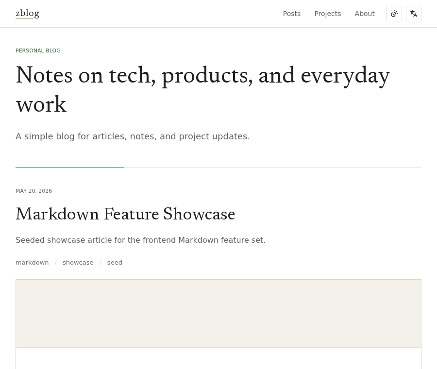
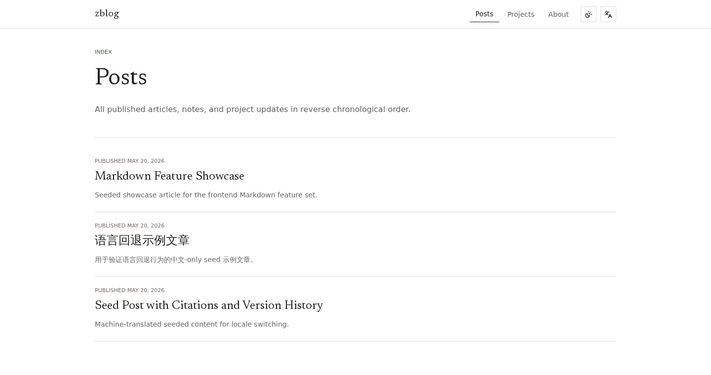
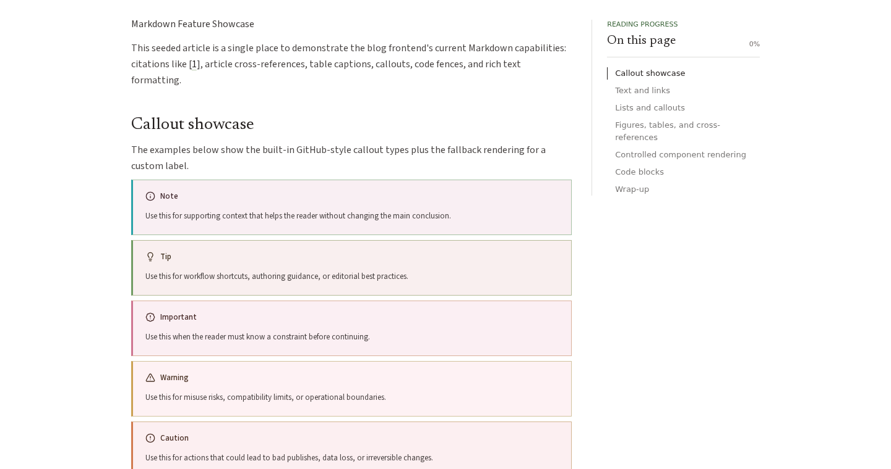

# ZBlog

ZBlog is a self-hostable publishing site for articles, notes, and project
updates. It is designed around a quiet reading experience, practical authoring
tools, seeded demo content, and a simple path from local development to a
single-server deployment.

## Preview



<details>
<summary>More screenshots</summary>

### Posts



### Article



</details>

## Highlights

- Public pages for posts, projects, archive, about, RSS, and utility content.
- Admin workspace for writing, media, previews, and site configuration.
- Markdown-centered article workflow with citations, attachments, and revision history.
- Local-first setup with seed content for development and screenshots.
- Docker Compose deployment for a small self-hosted instance.

## Getting Started

```bash
pnpm install
cp .env.example .env
```

For local development, use SQLite and local runtime state:

```bash
DATABASE_URL=file:.data/zblog.db
ZBLOG_STATE_DIR=.data
NEXT_PUBLIC_SITE_URL=http://localhost:3000
PAYLOAD_SECRET=replace-with-a-long-random-secret
```

Seed demo content and start the app:

```bash
pnpm run seed:blog:fresh
pnpm dev
```

Open `http://localhost:3000` for the site and `http://localhost:3000/admin`
for the admin area.

## Deployment

The included Docker Compose setup runs the app with SQLite and local filesystem
storage. It is intended for a single server behind an external reverse proxy
such as Nginx, Caddy, or Traefik. Compose binds the app to `127.0.0.1:3000`;
terminate TLS in the reverse proxy and forward traffic to that local address.

```bash
cp .env.example .env
openssl rand -base64 32
# put the generated value in PAYLOAD_SECRET
# set NEXT_PUBLIC_SITE_URL to the public https:// URL
docker compose up -d --build
```

`NEXT_PUBLIC_SITE_URL` is used while building the image, so rebuild after
changing the public URL.

On first boot with an empty `zblog-data` volume, the production server runs the
bundled Payload migrations to create the SQLite schema, including tables such as
`site_settings`. Seed data is optional; a missing seed can leave the site empty,
but a `no such table` error means the schema was not initialized or the image was
built before migrations were bundled.

Back up the `zblog-data` Docker volume to preserve the SQLite database, uploads,
generated previews, and import/export files:

```bash
mkdir -p backups
docker run --rm \
  -v zblog_zblog-data:/data:ro \
  -v "$PWD/backups:/backup" \
  alpine tar -czf /backup/zblog-data-$(date +%Y%m%d-%H%M%S).tgz -C /data .
```

Restore a backup into a stopped deployment:

```bash
docker compose down
docker run --rm \
  -v zblog_zblog-data:/data \
  -v "$PWD/backups:/backup:ro" \
  alpine sh -c 'rm -rf /data/* && tar -xzf /backup/zblog-data-backup.tgz -C /data'
docker compose up -d
```

## Documentation

- [Project documentation](./docs/README.md)
- Local reset: `pnpm run db:reset`
- Type check: `pnpm exec tsc --noEmit`
- Tests: `pnpm run test:int` and `pnpm run test:e2e`
